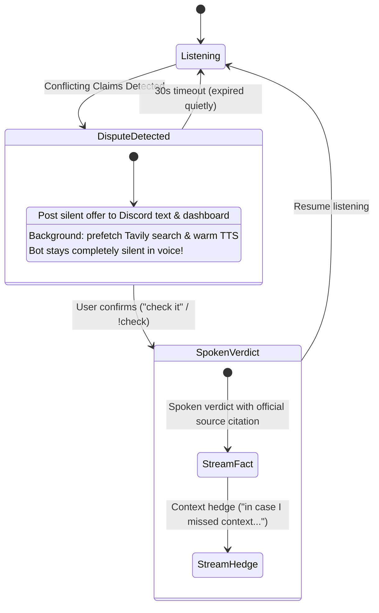

<div align="center">

# ⚖️ CallWrapped
### A Discord Voice Referee & "Call Wrapped" Analytics Bot
**Built for the [AssemblyAI Voice Agent Hackathon](https://lablab.ai/ai-hackathons/assemblyai-voice-agent-hackathon) (September 2026)**

[](https://www.assemblyai.com/)
[](https://groq.com/)
[](https://tavily.com/)
[](https://github.com/rany2/edge-tts)
[](https://discordpy.readthedocs.io/)
[](https://nextjs.org/)
[](LICENSE)

---

### 🎙️ [Watch the Demo Video](https://youtu.be/placeholder) | 🌐 [Live Web Dashboard](http://localhost:8000) | 🤖 [Invite Discord Bot](https://discord.com/oauth2/authorize?client_id=1550926707517558864&permissions=36718592&scope=bot%20applications.commands)

</div>

---

## 📖 Table of Contents
1. [What is CallWrapped?](#-what-is-callwrapped)
2. [How It Works](#-how-it-works)
3. [System Architecture](#-system-architecture)
4. [Live Judge Dashboard](#-live-judge-dashboard)
5. [Discord Commands](#-discord-commands)
6. [The Golden Demo (Step-by-Step)](#-the-golden-demo-step-by-step)
7. [Privacy & Ephemeral Memory](#-privacy--ephemeral-memory)
8. [Future Roadmap](#-future-roadmap)
9. [Quick Start & Setup](#-quick-start--setup)
10. [License](#-license)

---

## 💡 What is CallWrapped?

In voice calls with friends—whether in multiplayer gaming lobbies, study groups, tech debates, or podcasts—people constantly make contradictory factual claims with absolute confidence:
- *"Did the RTX 5070 launch with 12GB or 16GB VRAM?"*
- *"Who won the 2022 World Cup Golden Boot?"*
- *"Is that company acquisition real or a rumor?"*

Traditional voice assistants (Siri, Alexa) don't work in group calls because nobody pauses a heated debate to say *"Hey Siri"*. On the flip side, voice bots that barge in uninvited to interrupt and correct people create awkward friction and get kicked from the server immediately.

**CallWrapped solves this by acting as a polite, on-demand voice referee:**
1. **Silent Listening:** The bot transcribes multi-speaker audio in real time using **AssemblyAI Universal-3.5 Pro**.
2. **Background Fact-Checking:** When participants state conflicting facts, the bot extracts the claims using **Groq LPU**, queries **Tavily** for authoritative sources, and sends a discreet, silent offer in Discord text and on the live dashboard:  
   *"🤖 I noticed a disagreement on this fact — want me to check? Say 'check it' or type `!check`."*
3. **Consensual Voice Verdict:** The bot **never interrupts voice uninvited**. It only delivers a spoken resolution via **Edge-TTS** if someone explicitly confirms.
4. **Spotify-Style "Call Wrapped":** When the call wraps up (`!recap`), the bot generates a shareable visual summary showing who talked the most, topics discussed, and fun community badges like *The Diplomat* (spoke the most without arguing) or *The Monopolist* (hogged the microphone).

---

## 🛠️ How It Works

CallWrapped operates through a polite **Two-Stage Check**:



1. **Stage 1 (Silent Offer):** The bot verifies the disputed claim silently against live web sources. It posts an offer in the text channel without speaking in voice.
2. **Stage 2 (Confirmation):** If a user says *"شوفها"* / *"check it"* in voice or types `!check` in chat, the bot speaks the verified answer with citations.
3. **Barge-in Support:** If someone begins talking while the bot is answering, the bot immediately stops speaking so it never talks over users.

---

## 🏗️ System Architecture

CallWrapped is built with an event-driven Python backend and a real-time Next.js frontend:

1. **Audio Ingestion (Discord Voice):**
   - Ingests real-time voice packets with end-to-end MLS decryption via a native Discord DAVE adapter (`bot/audio/dave_adapter.py`).
   - Demuxes individual speaker audio into lock-protected 16kHz PCM ring buffers with energy-based Voice Activity Detection (VAD).

2. **Speech Recognition (AssemblyAI Universal-3.5 Pro):**
   - Processes finalized speech turns through AssemblyAI's batch transcription API.
   - Tuned to handle code-switching between Arabic and English gaming/tech terms.

3. **Split Epistemic Reasoning (Groq LPU):**
   - **Fast Claim Path:** Sub-second claim extraction prompt identifying disputed entities and numerical values.
   - **Batched Analytics Path:** 75-second rolling window aggregating conversation turns to calculate 15-category topic talk shares and speaker streaks.
   - **Key Rotation Pool:** Automatically rotates across up to 6 Groq API keys with graceful 429 recovery to prevent rate limits during active sessions.

4. **Fact Verification & Voice Output:**
   - **Tavily Search:** Fetches real-world domain citations and filters out private personal claims.
   - **Microsoft Edge-TTS:** Pre-warmed streaming connection delivering a verified fact followed by a polite hedge.

5. **Live Dashboard Hub (FastAPI + Next.js 14):**
   - FastAPI WebSocket hub broadcasts dispute cards, latency telemetry, and speaker statistics to a Next.js 14 web interface.

---

## 🖥️ Live Judge Dashboard

Served locally at `http://localhost:8000` via FastAPI and Next.js 14:

- **Balanced Two-Column Interface:**
  - **Left Column:** Live Referee card showing active disputes stacked above the Real-Time Discord Voice Transcript Stream.
  - **Right Column:** Conversational analytics, 15-category topic distribution, and session stats.
- **Compact Pipeline Telemetry (~740px):** Displays the 6 processing stages (`AssemblyAI STT`, `Claim Extraction`, `Dispute FSM`, `Tavily Search`, `Two-Stage Gate`, `Edge-TTS Audio`) with live latency badges.
- **Audio Evidence Playback:** Interactive audio buttons on dispute cards and recap widgets allowing judges to stream the recorded WAV audio evidence directly in the browser via `/api/audio-evidence/{filename}`.
- **CallWrapped Showcase Modal:** Complete summary with speaker talk share percentages, topics discussed, and cultural banter badges:
  - 🕊️ **The Diplomat:** Spoke the most without any anger, vulgarity, or roasts.
  - 🤫 **The Silent Observer:** Active listener with minimal talk share and zero interruptions.
  - 🔥 **The Instigator:** Speaker involved in the highest number of disputes.
  - 🔍 **The Fact Checker:** Speaker with the most verified true claims.
  - 🎙️ **The Monopolist:** Highest talk-time share of the call.
  - ⚡ **The Speed Demon:** Quickest response turnaround.

---

## 🎮 Discord Commands

| Command | Arguments | Description |
| :--- | :--- | :--- |
| `!join` | None | Connects the bot to your current voice channel. |
| `!start` | None | Activates fact-checking mode and posts the session transparency notice. |
| `!check` | None | Confirms a pending dispute offer and triggers spoken verdict in voice. |
| `!arbitrate` | `<claim>` | Manually requests verification for a specific factual claim. |
| `!recap` | None | Generates the session's Spotify-style CallWrapped card and badges. |
| `!stats` | None | Displays current speaker talk shares in chat. |
| `!status` | None | Reports active session phase, dispute counts, and latency averages. |
| `!dashboard` | None | Displays the link to the local Next.js Live Judge Dashboard. |
| `!privacy` | None | Displays data retention details and ephemeral memory policies. |
| `!clear` | None | Resets session memory and claim history. |
| `!leave` | None | Disconnects the bot from voice and purges active session context. |

---

## 🎬 The Golden Demo (Step-by-Step)

1. Join a Discord voice channel and type `!join`.
2. Activate fact-checking mode by typing `!start`.
3. Open the Live Dashboard at `http://localhost:8000`.
4. Say the conflicting claims in voice (or click **"Replay RTX 5070 Live Demo Session"** on the dashboard):
   - **Speaker 1:** *"The RTX 5070 launched with 16GB VRAM from Nvidia."*
   - **Speaker 2:** *"No way, it only launched with 12GB GDDR7, there is no 16GB version."*
5. **Stage 1 (Silent Text Offer):** The bot posts an offer in the text channel and dashboard:  
   *"🤖 I noticed a disagreement on this fact — want me to check? Say 'check it' or type `!check`."*  
   *(Notice: The bot remains completely silent in voice).*
6. **Stage 2 (Confirmation):** Say *"check it"* in voice (or type `!check` in chat).
7. **Spoken Verdict:** The bot speaks the verified answer with Nvidia source citations, while the dashboard highlights the dispute card with verified badges.
8. Type `!recap` to see your session's CallWrapped recap card and awards.

---

## 🔒 Privacy & Ephemeral Memory

- **Session-Only Memory:** CallWrapped does not store long-term conversational profiles. When `!leave` or `!clear` is invoked, all conversation memory, speaker statistics, and pending claims are wiped.
- **Private Entity Refusal:** The bot automatically ignores personal claims about private individuals (*"Ahmed said he bought a car"*) to protect user privacy and avoid hallucinated web searches.
- **Transparency Notice:** When `!start` is called, the bot posts a clear operating policy in chat so everyone in the channel knows how it operates.

---

## 🗺️ Future Roadmap

- [ ] **Sovereign Open-Weight Model:** Train and fine-tune an open-source model (e.g., Llama-3-8B or Qwen-2.5 on multi-speaker bilingual dialogue) running locally via vLLM to eliminate dependency on third-party cloud APIs like Groq.
- [ ] **Full-Duplex Streaming STT:** Migrate from batch audio polling to full WebSocket streaming once dialect accuracy on rapid multi-party conversational overlap matches batch performance.
- [ ] **Community Hosted Bot:** Package as an authorized Discord application so community server moderators can add it with a single invite link.

---

## ⚡ Quick Start & Setup

### Prerequisites
- **Python:** 3.12+ (tested on Windows 11 & Linux)
- **Node.js:** 18+ (for Next.js frontend)
- **FFmpeg:** Required for voice playback (`winget install Gyan.FFmpeg` on Windows, or `apt install ffmpeg` on Linux)
- **API Keys Required:**
  - `ASSEMBLYAI_API_KEY`: Speech-to-text processing.
  - `GROQ_API_KEY`: Fast claim extraction and topic classification.
  - `TAVILY_API_KEY`: Live web search verification.
  - `DISCORD_BOT_TOKEN`: Discord application bot token with voice and message intents.

### 1. Installation
```bash
git clone https://github.com/Kirolos-Maurice-William/CallsWrapped.git
cd CallsWrapped

# Python setup
python -m venv backend/venv
backend/venv/Scripts/activate     # Windows
# source backend/venv/bin/activate  # Linux
pip install -r requirements.txt
```

### 2. Configuration
```bash
cp .env.example .env
```
Populate your API keys in `.env` (`DISCORD_BOT_TOKEN`, `ASSEMBLYAI_API_KEY`, `GROQ_API_KEY`, `TAVILY_API_KEY`).

### 3. Build Frontend Dashboard
```bash
cd frontend && npm install && npm run build && cd ..
```

### 4. Launch Services
```bash
start_all.bat
```
*(Or launch `start_backend.bat`, `start_bot.bat`, and `start_frontend.bat` in separate terminals).*

---

## 📄 License

This project is licensed under the [MIT License](LICENSE).

<div align="center">
<b>CallWrapped — Respectful Factual Grounding & Conversational Intelligence for Voice Calls.</b>
</div>
