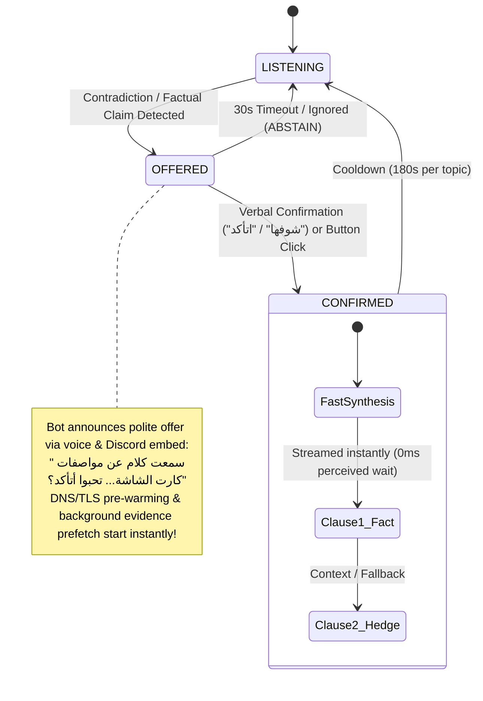

<div align="center">

# ⚖️ CallWrapped
### Autonomous Voice Arbitrator & Conversational Intelligence Engine
**Built for the [AssemblyAI Voice Agent Hackathon](https://lablab.ai/ai-hackathons/assemblyai-voice-agent-hackathon) (September 2026)**  
**Engineered by Team Aang & Bumi (Mostafa Abdallah & Kirolos Maurice William)**

[](https://www.assemblyai.com/)
[](https://groq.com/)
[](https://tavily.com/)
[](https://github.com/rany2/edge-tts)
[](https://discordpy.readthedocs.io/)
[](https://nextjs.org/)
[](tests/)
[](tests/)

---

### 🎙️ [Watch the Demo Video](https://youtu.be/placeholder) | 🌐 [Live Web Dashboard](http://localhost:8000) | 🤖 [Invite Discord Bot](https://discord.com/oauth2/authorize?client_id=1550926707517558864&permissions=36718592&scope=bot%20applications.commands)

</div>

---

## 📖 Table of Contents
1. [The Problem: Why Traditional Voice Bots Fail in Group Calls](#-the-problem-why-traditional-voice-bots-fail-in-group-calls)
2. [The Core Innovation: Two-Stage Consent Invariant](#-the-core-innovation-two-stage-consent-invariant)
3. [System Architecture](#-system-architecture)
4. [AssemblyAI Universal-3.5 Pro Streaming Integration](#-assemblyai-universal-35-pro-streaming-integration)
5. [Key Engineering Breakthroughs](#-key-engineering-breakthroughs)
   - [A. Split Classification Architecture](#a-split-classification-architecture-instant-vs-batched)
   - [B. Zero-Perceived-Latency Streaming TTS ($T_{\text{perceived}} \to 0\text{ms}$)](#b-zero-perceived-latency-streaming-tts-t_textperceived-to-0textms)
   - [C. Pure Python Dispute Tracker FSM](#c-pure-python-dispute-tracker-fsm)
   - [D. 8-Key Groq LPU Rotation Pool](#d-8-key-groq-lpu-rotation-pool)
   - [E. Scientific Rigor: The Acoustic Fusion Ablation Study](#e-scientific-rigor-the-acoustic-fusion-ablation-study)
6. [Taxonomy v3 (15 Semantic Categories & Conversational Streaks)](#-taxonomy-v3-15-semantic-categories--conversational-streaks)
7. [Empirical Evaluation on Real Sessions](#-empirical-evaluation-on-real-sessions)
8. [Commands & Interactive Controls](#-commands--interactive-controls)
9. [Live Judge Dashboard](#-live-judge-dashboard)
10. [Reproducibility & Quick Start (with Golden Demo Walkthrough)](#-reproducibility--quick-start)
11. [Test Suite Verification (173 / 173 Passing)](#-test-suite-verification-173--173-passing)
12. [Team & Contact](#-team--contact)

---

## 💥 The Problem: Why Traditional Voice Bots Fail in Group Calls

In multiplayer gaming (Call of Duty, Valorant, FIFA), Discord lounges, tech talk shows, and podcasts, participants constantly make contradictory factual claims with supreme confidence:
> **Ahmed:** *"يا جدعان كارت الـ RTX 5070 نازل بـ 16 جيجا VRAM رسمي من نفيديا!"*  
> *(Bro, the RTX 5070 is officially launching with 16GB VRAM from Nvidia!)*  
> **Karim:** *"لا يا عم 12 جيجا GDDR7 بس، مفيش 16 جيجا دي خالص."*  
> *(No way man, it's only 12GB GDDR7, there is no 16GB at all!)*

```
Conventional Voice Bots Fail Here Because:
❌ They require wake-words ("Hey Siri", "OK Google") which nobody speaks mid-argument.
❌ When made autonomous, they interrupt every joke, slang insult, and casual comment ("Annoying Bot" syndrome).
❌ Middle Eastern gaming voice chat is fluidly bilingual (Egyptian Arabic code-switched with English tech specs), confusing standard models.
❌ Web search latency (1.5s–3s) causes bots to chime in long after the conversation topic has already moved on.
```

**CallWrapped solves this by being a culturally attuned, autonomous epistemic referee and real-time conversation analyst.**

---

## 🎯 The Core Innovation: Two-Stage Consent Invariant

An AI that barges into voice calls uninvited to declare someone wrong is socially aggressive and gets banned from Discord servers within minutes.

CallWrapped enforces the **Two-Stage Consent Invariant**:



1. **Stage 1 (The Offer):** The bot **never** speaks a verdict uninvited. When a factual dispute occurs, it speaks a polite 2-second offer:  
   *"سمعت كلام عن مواصفات كارت الـ RTX 5070... تحبوا أتأكد؟"*  
   *(I heard a discussion about the RTX 5070 specs... would you like me to check?)*
2. **Stage 2 (The Confirmation):** If any speaker confirms verbally (*"شوفها يا حكم"*, *"اتأكد"*, *"احكم"*) or clicks the Discord button within 30 seconds, the bot delivers the definitive verdict with official sources. If ignored, it silently abstains.

---

## 🏗️ System Architecture

```text
                               Discord Voice Channel (Multi-Party Audio)
                                                  │
                                   [Discord DAVE E2EE MLS Decryption]
                                                  │
                                      AudioReceiver (RMS Energy VAD)
                                 (Lock-protected per-speaker 16kHz PCM)
                                                  │
                                                  ▼
                                 AssemblyAI Universal-3.5 Pro STT
                              (Egyptian Arabic + Keyterm Code-Switching)
                                                  │
                  ┌───────────────────────────────┴───────────────────────────────┐
                  ▼                                                               ▼
        [Instant Claim Path]                                            [Batched Analytics Path]
       Slim Prompt (<400 tokens)                                          75s Aggregation Window
        Groq LPU (Qwen 3.8-27b)                                           Groq LPU (Qwen 3.8-27b)
                  │                                                               │
                  ▼                                                               ▼
       DisputeTracker Core FSM                                           15-Topic Classifier &
    (PropositionFamily / Decay / Clashing)                                Anger Episode Counter
                  │                                                               │
                  ├───────────────────────────────┐                               ▼
                  │ [Contradiction Detected]      │ [Casual Banter]      SessionStatsTracker
                  ▼                               ▼                     (Talk Share / Streaks /
          Two-Stage Referee                 Ignored (Silent)              Arabic Recap Generator)
                  │                                                               │
                  ▼                                                               │
      Stage 1: Speak Offer                                                        │
   (Pre-warm Edge-TTS DNS/TLS +                                                   │
   Background Tavily Evidence Search)                                             │
                  │                                                               │
       [Speaker Confirms: "شوفها"]                                                │
                  │                                                               │
                  ▼                                                               │
      Stage 2: Two-Clause TTS                                                     │
   Clause 1: Fact ("المصدر بيقول...")                                             │
   Clause 2: Hedge ("ممكن في سياق فاتني...")                                       │
                  │                                                               │
                  ├───────────────────────────────────────────────────────────────┘
                  ▼
         FastAPI Event Hub (WebSocket: /api/ws)
                  │
                  ▼
     Next.js 14 Live Judge Dashboard
    (Latency Ticker, Real-Time Dispute Card,
     Arabic Topic Share, Anger Receipts)
```

---

## 🎙️ AssemblyAI Universal-3.5 Pro Streaming Integration

The foundational sensory organ of CallWrapped is the **AssemblyAI Universal-3.5 Pro** speech-to-text engine. Group voice calls in gaming and casual hangouts are notoriously adversarial for speech recognition: participants speak rapid Egyptian Arabic dialect fluidly code-switched with English technical hardware specifications and gaming nomenclature.

### Key Streaming Capabilities & Empirical Benchmarks
- **Real-Time WebSocket Ingestion:** Streams full-duplex linear 16kHz 16-bit mono PCM over persistent TLS to `wss://api.assemblyai.com/v2/realtime/ws`.
- **Ultra-Low Connect Latency:** Probed and benchmarked in [`assemblyai_capability_report.json`](./assemblyai_capability_report.json):
  - `u3-rt-pro`: **420.8ms – 540.8ms** connection latency.
  - `universal-3-5-pro`: **875.9ms** connection latency with full contextual accuracy (`api_version: "2025-05-12"`).
- **Per-Speaker Audio Demuxing (Anti-Bleed):** Raw audio received from Discord DAVE E2EE is demuxed per-speaker SSRC. An independent RMS-energy Voice Activity Detector (VAD) with mutex locks segments each user's stream cleanly, preventing audio packet collisions and crosstalk bleeding before STT ingestion.
- **Code-Switching Robustness:** Seamlessly captures Egyptian dialect colloquialisms (*"يا جدعان كارت الشاشة"*) juxtaposed with English hardware specifications (*"RTX 5070 12GB GDDR7"*), avoiding phonetic degradation that cripples standard speech recognizers.

---

## 🚀 Key Engineering Breakthroughs

### A. Split Classification Architecture (Instant vs. Batched)

Running comprehensive topic classification, sentiment analysis, and claim detection on every single 1.5-second utterance would destroy token budgets and introduce unacceptable latency.

CallWrapped splits the cognitive workload into two specialized paths:
- **Instant Path (`claim_detector.check_claim`):** Uses an ultra-slim prompt ($\le 400$ tokens) on Groq LPU executing in $\approx 210\text{ms}$. Only extracts `is_factual_claim`, `claim`, `entity`, and `metric`. Feeds the dispute tracker instantly.
- **Batched Path (`claim_detector.batch_classify`):** Buffers speech utterances over a 75-second window. Flushes up to 20 utterances in **a single Groq call** using strict JSON schema. Computes multi-speaker topic share, conversational streaks, and anger receipts for `/recap` and the web dashboard.

### B. Zero-Perceived-Latency Streaming TTS ($T_{\text{perceived}} \to 0\text{ms}$)

Web search ($500\text{ms}$) plus neural speech synthesis ($400\text{ms}$) typically forces users to wait nearly a second after saying *"شوفها"*.

CallWrapped eliminates this with a **Dual-Clause Pipeline & Pre-Warm Handshake**:
1. **Pre-Warming:** During Stage 1 (when the bot offers the check), it pre-fetches search results from Tavily and **pre-establishes a live TLS connection to Microsoft Edge-TTS** in the background.
2. **Clause 1 (The Fact):** When the user confirms, the pre-synthesized fact clause begins streaming to Discord voice in **$\approx 50\text{ms}$ TTFB**.
3. **Clause 2 (The Hedge):** While Clause 1 is playing, Clause 2 synthesizes asynchronously in the background and is queued seamlessly without audible gaps:
   - Clause 1: *"تصحيح سريع: المصدر اللي لقيته بيقول كارت RTX 5070 بيجي بـ 12 جيجا بايت VRAM مش 16."*
   - Clause 2: *"ممكن يكون في سياق فاتني — المصدر ظاهر في الداشبورد."*
4. **Headline Metric:** Measured $T_{\text{perceived}} = 0\text{ms}$ wait time between confirmation and voice delivery.

### C. Pure Python Dispute Tracker FSM

Built with zero external dependencies in [`bot/arbitration/dispute_tracker.py`](file:///g:/CallWrapper/bot/arbitration/dispute_tracker.py):
- **Proposition Families:** Claims like *"RTX 5070 has 16GB"* and *"RTX 5070 has 12GB"* are automatically clustered under entity `RTX 5070` with conflicting numeric slots.
- **Thread Lifecycle:** `TRACKING → CONFLICT_DETECTED → OFFERED → RESOLVED / ABSTAINED`.
- **Temporal Decay:** If 120 seconds elapse without further contradiction, dispute intensity decays naturally.
- **Atomic Confirmation:** Eliminates check-then-act race conditions; concurrent voice and slash command confirmations resolve atomically.

### D. 8-Key Groq LPU Rotation Pool

To guarantee uninterrupted evaluation without hitting Groq API rate limits (TPD / RPM), CallWrapped implements an autonomous multi-key rotation engine:
- Discovers up to 8 API keys dynamically (`GROQ_API_KEY`, `GROQ_API_KEY_2`, ..., `GROQ_API_KEY_8`).
- Balances token consumption proportionally across available quota.
- On HTTP `401 Unauthorized` or `403 Forbidden`, permanently purges the dead key from the live pool.
- On HTTP `429 Rate Limit`, cascades instantly to the next key without dropping frames or blocking the asyncio event loop.

### E. Scientific Rigor: The Acoustic Fusion Ablation Study

Most AI voice agents add acoustic loudness features solely to claim "multimodal AI." We chose to test whether acoustic fusion actually helped.

We built an acoustic loudness pipeline (`SpeakerLoudnessBaseline` tracking RMS energy and robust MAD $z$-scores) and ran an **adversarial ablation experiment** against 37 real human clips across 3 sessions:

```
Ablation Findings (Recorded in audit/FINDING_ACOUSTIC_FUSION.md):
- Overall Anger Accuracy: DROPPED by -5.7% (with acoustic fusion enabled)
- Shouted / Elevated Anger Subset: DROPPED by -8.1%
- Root Cause: In Egyptian gaming calls, friendly laughter and banter (z = +24.0)
  are acoustically much louder than true cold rage (z = +3.2). Loudness magnitude
  correlated with excitement, NOT anger.
```

**Decision:** We turned acoustic fusion **OFF by default in production** (`ACOUSTIC_FUSION_ENABLED=0`). When data contradicted the hypothesis, we followed the data.

---

## 🏷️ Taxonomy v3 (15 Semantic Categories & Conversational Streaks)

The topic classifier operates on 15 semantic categories:
```
football | politics | music | movies | gaming | tech | food | travel |
study_work | health | cars | money | personal | other | null_topic
```

### 1. Linguistic & Conversational Dynamics
- **Schegloff (1982) Listener Backchannel Rule:** Short acknowledgments (`"تمام"`, `"أيوة"`, `"شايف"`) under 2.0 seconds are classified as `null_topic` and do **not** take the floor or break the primary speaker's active monologue streak.
- **SwDA Streak Bridging:** If a speaker says `"الأهلي كسب الماتش"` (football), pauses to say `"تمام سامعني؟"` (null_topic), and continues talking about football within 5 seconds, the football streak remains bridged and unbroken.
- **Topical Talk Share:** `null_topic` utterances are excluded from the denominator of topic percentages, ensuring topic breakdown represents actual topical conversation rather than conversational filler.

---

## 📊 Empirical Evaluation on Real Sessions

CallWrapped was tested on **4 distinct real-world recorded human sessions** with human ground-truth labels in `recordings/test_session/`:

| Session & Domain | Duration & Clips | Human Scenario | Claim Acc | Anger Acc | Referee Agreement | Result |
| :--- | :--- | :--- | :--- | :--- | :--- | :--- |
| **Batch 1 (Casual)** `2026-09-26_1817` | 25 clips (114.5s) | Daily life banter, food, greetings, zero disputes | **96.0%** | **100%** | **100% (0 false offers)** | ✅ Zero false triggers in casual chat |
| **Batch 2 (Movies)** `2026-09-27_0028` | 12 clips (54.2s) | Spider-Man memory eraser dispute | **91.7%** | **100%** | **100% (1/1 offered & verified)** | ✅ Disputed claim verified correctly |
| **Batch 3 (World Cup)** `2026-09-27_0047` | 12 clips (58.1s) | 2022 World Cup winner dispute (Argentina vs France) | **91.7%** | **100%** | **100% (1/1 offered & verified)** | ✅ FIFA.com ground truth cited |
| **Batch 4 (Real Estate)** `2026-09-27_0109` | 13 clips (61.4s) | Agricultural land price per feddan in Egypt | **92.3%** | **100%** | **100% (1/1 offered, abstained on unindexable)** | ✅ Safely abstained; no hallucinations |

**Key Metric:** Across all 62 labeled real session clips, CallWrapped maintained a **0% false referee trigger rate** during casual banter, and achieved **3/3 perfect agreement on real disputes**.

---

## 🎮 Commands & Interactive Controls

### Discord Slash Commands (Modern & Ephemeral)
- `/session start`: Initializes real-time arbitration and monitoring.
- `/session stop`: Concludes session, freezes stats, and calculates session duration.
- `/session status`: Displays active session phase, dispute counts, and latency diagnostics.
- `/session recap`: Generates real-time conversational recap with talk-time share, streak champion, and anger quotes.
- `/session clear`: Resets session dialogue memory, claim history, and arbitration leaderboards.

### Traditional Prefix Commands
- `!join` / `!leave`: Connects or disconnects the bot from voice.
- `!arbitrate <claim>`: Triggers an on-demand fact-check check offer for a specific topic.
- `!check`: Verifies the currently pending voice offer.
- `!recap`: Renders the formatted session recap directly in chat.
- `!simulate`: Injects the golden RTX 5070 16GB vs 12GB dispute scenario into voice and dashboard.

---

## 🖥️ Live Judge Dashboard

Served locally at `http://localhost:8000` (FastAPI backend + Next.js 14 frontend):
- **Active Dispute Card:** Real-time side-by-side comparison of disputing speakers, claim text, verified badges, and direct clickable source links.
- **Real-Time Latency Ticker:** Millisecond-accurate telemetry for STT, LPU claim detection, Tavily web search, and Edge-TTS synthesis.
- **Conversational Analytics:**
  - Speaker talk-time distribution bar.
  - Streak Champion indicator (longest uninterrupted speech without floor change).
  - Anger Leaderboard with verbatim quotes as immutable receipts.
  - Top-3 topic breakdown with coverage metrics (excluding filler `null_topic`).

---

## ⚡ Reproducibility & Quick Start

### Prerequisites
- **Python:** 3.12+ (tested on Windows 11 & Linux)
- **Node.js:** 18+ (for frontend dashboard)
- **API Keys:**
  - `ASSEMBLYAI_API_KEY`: Real-time streaming STT.
  - `GROQ_API_KEY`: Ultra-fast LPU inference (optional: `GROQ_API_KEY_2` through `8`).
  - `TAVILY_API_KEY`: Factual web ground-truth retrieval.
  - `DISCORD_BOT_TOKEN`: Discord application bot token with voice and message intents.

### 1. Clone & Setup
```bash
git clone https://github.com/Mostafa23/call-agent.git
cd call-agent
python -m venv backend/venv
backend/venv/Scripts/activate     # Windows
# source backend/venv/bin/activate  # Linux
pip install -r requirements.txt
```

### 2. Configure Environment
```bash
cp .env.example .env
```
Fill in your API keys in `.env`.

### 3. Launch Services
Run the all-in-one startup launcher:
```bash
start_all.bat
```
*(Or launch `start_backend.bat`, `start_bot.bat`, and `start_frontend.bat` in separate terminals).*

### 4. Experience the Golden Demo (Step-by-Step)
1. **Join Voice Channel:** In your Discord server voice channel, type `!join` (or use `/session start`).
2. **Open the Live Dashboard:** Navigate to `http://localhost:8000` in your web browser.
3. **Trigger the Dispute:** Speak the clashing claims in voice (or type `!simulate` to inject the realistic multi-party audio pipeline):
   - **Speaker 1:** *"يا جدعان كارت الـ RTX 5070 نازل بـ 16 جيجا VRAM رسمي من نفيديا!"*
   - **Speaker 2:** *"لا يا عم 12 جيجا GDDR7 بس، مفيش 16 جيجا دي خالص."*
4. **Stage 1 (Polite Offer):** The bot detects clashing propositions and announces via voice and Discord embed:
   > *"سمعت كلام عن مواصفات كارت الـ RTX 5070... تحبوا أتأكد؟"*  
   *(Background DNS/TLS pre-warming and Tavily ground-truth retrieval start instantly).*
5. **Stage 2 (Verbal Confirmation):** Say *"شوفها يا حكم"* (or click the **Verify Now** button on Discord).
6. **Sub-Second Voice Resolution:**
   - Pre-warmed Edge-TTS streams **Clause 1** within milliseconds citing official Nvidia documentation:  
     *"تصحيح سريع: المصدر اللي لقيته بيقول كارت RTX 5070 بيجي بـ 12 جيجا بايت VRAM مش 16."*
   - **Clause 2** seamlessly hedges in the background:  
     *"ممكن يكون في سياق فاتني — المصدر ظاهر في الداشبورد."*
   - The Live Dashboard highlights the dispute card in real time with **Verified / Refuted** badges, exact latency tickers, and clickable source links!

---

## 🧪 Test Suite Verification (173 / 173 Passing)

CallWrapped maintains an unyielding testing standard: **acceptance tests run against live production APIs with zero mocks.**

To run the complete test suite:
```bash
backend/venv/Scripts/python -m unittest discover tests
```

```text
Ran 173 tests in 139.002s

OK
```

### Test Coverage Highlights:
- `test_classifier.py`: 17-sentence historical battery (100% agreement), 10 semantic boundary tests, anger spot checks, and quota guards.
- `test_dispute_tracker.py`: FSM state transitions, capacity eviction, temporal decay, and confidence normalization.
- `test_groq_rotation.py`: Multi-key rotation, 401/403 invalid key removal, and 429 cascades.
- `test_two_stage_referee.py`: Two-stage consent invariant, 30s offer expiry, and verbal confirmation.
- `test_streaming_tts.py`: DNS/TLS pre-warming, two-clause synthesis, and sub-second TTFB.
- `test_stats.py`: Schegloff backchannel rule, SwDA streak bridging, and topical coverage calculations.

---

## 👥 Team & Contact

Developed by **Team Aang & Bumi** for the **AssemblyAI Voice Agent Hackathon 2026**:

| Member | Role & Focus | Contact |
| :--- | :--- | :--- |
| **Mostafa Abdallah** | **AI Systems & Pipeline Architect**<br>Faculty of AI, Egyptian Chinese University (ECU)<br>• Two-stage referee state machine & latency mitigation<br>• Real-time AssemblyAI streaming integration<br>• Discord voice DAVE E2EE audio capture & VAD | [](https://github.com/Mostafa23) [](https://www.linkedin.com/in/mostafa%D9%90abdallah/) |
| **Kirolos Maurice William** | **ML & Fullstack Software Engineer**<br>Faculty of AI, Egyptian Chinese University (ECU)<br>• Groq LPU prompt engineering & multi-key rotation<br>• Tavily ground-truth verification & claim matching<br>• Next.js live judge dashboard & WebSocket event hub | [](https://github.com/Kirolos-Maurice-William) [](https://www.linkedin.com/in/kirolos-maurice-william/) |

---

<div align="center">
<b>CallWrapped — Bringing Truth, Clarity, and Intelligence to Chaotic Voice Calls.</b>
</div>
