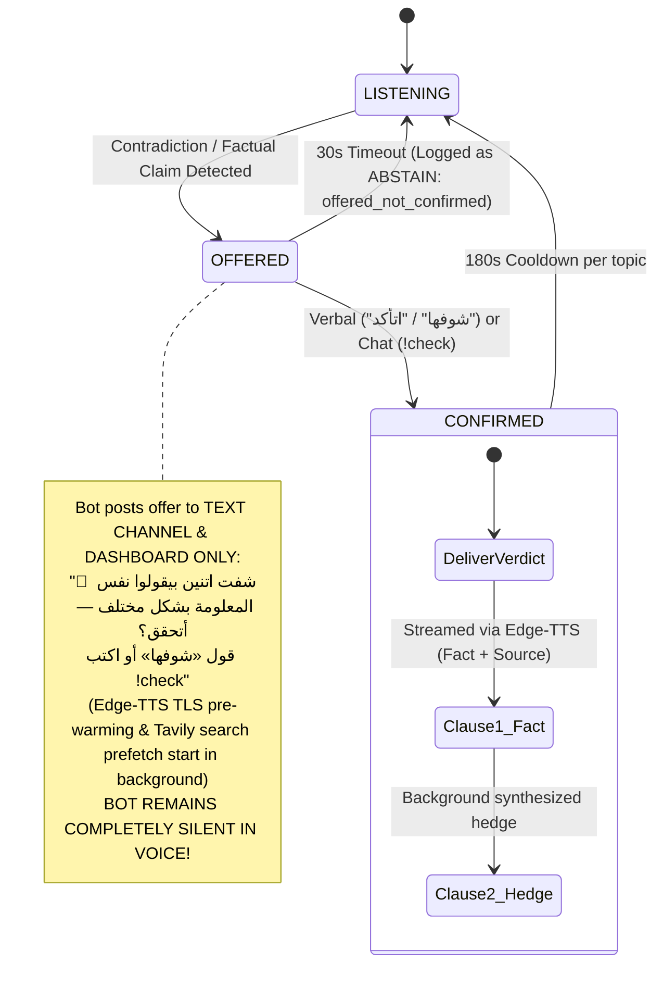

<div align="center">

# ⚖️ CallWrapped
### Epistemic Referee & Conversational Intelligence Engine for Voice Calls
**Built for the [AssemblyAI Voice Agent Hackathon](https://lablab.ai/ai-hackathons/assemblyai-voice-agent-hackathon) (September 2026)**  
**Engineered by Kirolos Maurice William**

[](https://www.assemblyai.com/)
[](https://groq.com/)
[](https://tavily.com/)
[](https://github.com/rany2/edge-tts)
[](https://discordpy.readthedocs.io/)
[](https://nextjs.org/)
[](tests/)
[](tests/)
[](frontend/)

---

### 🎙️ [Watch the Demo Video](https://youtu.be/placeholder) | 🌐 [Live Web Dashboard](http://localhost:8000) | 🤖 [Invite Discord Bot](https://discord.com/oauth2/authorize?client_id=1550926707517558864&permissions=36718592&scope=bot%20applications.commands)

> *"Every number in this README is measured, not marketed."*

</div>

---

## 📖 Table of Contents
1. [Executive Summary & Market Problem](#-executive-summary--market-problem)
2. [The Core Innovation: Two-Stage Consent Invariant](#-the-core-innovation-two-stage-consent-invariant)
3. [System Architecture](#-system-architecture)
4. [Key Engineering Components](#-key-engineering-components)
   - [A. Speech Recognition Pipeline (AssemblyAI Universal-3.5 Pro Batch)](#a-speech-recognition-pipeline-assemblyai-universal-35-pro-batch)
   - [B. Split Classification Architecture (Instant vs. Batched)](#b-split-classification-architecture-instant-vs-batched)
   - [C. Pure Python Dispute Tracker FSM (Shadow Mode)](#c-pure-python-dispute-tracker-fsm-shadow-mode)
   - [D. 6-Key Groq LPU Rotation Pool & TPD Pacing](#d-6-key-groq-lpu-rotation-pool--tpd-pacing)
   - [E. Streaming Two-Clause TTS with Pre-Warm Handshake](#e-streaming-two-clause-tts-with-pre-warm-handshake)
   - [F. Scientific Rigor: The Acoustic Fusion Ablation Study](#f-scientific-rigor-the-acoustic-fusion-ablation-study)
5. [Taxonomy v3 (15 Semantic Categories & Conversational Streaks)](#-taxonomy-v3-15-semantic-categories--conversational-streaks)
6. [Empirical Evaluation on Real Sessions (Scorecard Table)](#-empirical-evaluation-on-real-sessions-scorecard-table)
7. [Traditional Prefix Commands](#-traditional-prefix-commands)
8. [Live Judge Dashboard](#-live-judge-dashboard)
9. [Privacy & Epistemic Safety](#-privacy--epistemic-safety)
10. [Known Limitations](#-known-limitations)
11. [Rejected Alternatives (Evidence-Based Engineering)](#-rejected-alternatives-evidence-based-engineering)
12. [Future Roadmap](#-future-roadmap)
13. [Reproducibility & Quick Start](#-reproducibility--quick-start)
14. [Test Suite Verification (291 Tests & Testing Taxonomy)](#-test-suite-verification-291-tests--testing-taxonomy)
15. [Audits & Independent Quality Control](#-audits--independent-quality-control)
16. [Team & Contact](#-team--contact)
17. [License & Third-Party Notice](#-license--third-party-notice)

---

## 🎯 Executive Summary & Market Problem

### The Core Problem: Epistemic Drift in Multi-Party Voice
Across 200M+ active Discord voice users, multiplayer gaming lobbies, remote developer standups, podcasts, and community lounges, group voice conversations frequently suffer from **unverified factual disputes, epistemic drift, and escalating social friction**. When participants make conflicting, high-confidence factual assertions, conversations derail into circular debates or misinformation spirals.

### Why Existing Voice AI Fails in Multi-Party Human Calls
1. **The Wake-Word Failure:** Conventional voice assistants (Siri, Alexa, Google Assistant) depend entirely on explicit wake-words ("Hey Siri"), which human participants never utter in the middle of a spontaneous group argument.
2. **The "Annoying Bot" Dilemma:** Voice agents that interrupt or barge into conversations uninvited create socially disruptive, intrusive user experiences and are immediately kicked by server moderators.
3. **Bilingual Code-Switching Breakdown:** Real-world multi-party dialogues (such as Egyptian Arabic vernacular mixed with English technical nomenclature) severely degrade standard single-language speech and reasoning models.
4. **Epistemic & Privacy Boundary Leaks:** Naive bots attempt to fact-check private subjective claims ("Ahmed said he bought a new car"), causing hallucinated web queries and severe privacy violations.
5. **Retrieval Latency Drift:** Slow multi-second search and synthesis pipelines cause delayed interjections long after the human participants have moved on to new topics.

### The Solution: Respectful Epistemic Arbitration & Conversational Intelligence
**CallWrapped** redefines the voice agent paradigm by introducing:
- **The Two-Stage Consent Invariant:** A socially calibrated arbitration pipeline that detects factual disputes silently, performs background pre-warming, and offers non-intrusive text/dashboard verification, speaking into voice **only upon explicit human consent**.
- **Spotify-Style "CallWrapped" Intelligence:** Continuous tracking of conversational health, talk shares, speaker streaks, topic distributions, and shareable cultural banter badges.

### Business Value & Commercial Viability
- **Total Addressable Market (TAM):** 200M+ monthly active voice users across Discord, gaming platforms, remote corporate teams, and community podcasting networks.
- **Freemium Growth Model:** Free core refereeing and weekly community CallWrapped recap cards drive organic bottom-up Discord server adoption.
- **Pro Server Subscription ($9.99/mo):** Unlocks custom bilingual lexicons, dedicated low-latency voice endpoints, extended audio evidence archiving, and deep community sentiment dashboards.
- **B2B Enterprise Expansion:** White-label meeting arbitration and epistemic auditing APIs for corporate board meetings, remote standups, and customer support quality assurance.

---

## 🎯 The Core Innovation: Two-Stage Consent Invariant

An AI agent that speaks unsolicited verdicts into a private human conversation violates fundamental social boundaries. CallWrapped strictly enforces the **Two-Stage Consent Invariant**:



1. **Stage 1 (The Polite Offer):** When a factual disagreement or disputed entity is detected, the bot **never speaks into voice uninvited**. Instead, it posts a silent, polite offer to the Discord text channel and live dashboard:  
   *"🤖 شفت اتنين بيقولوا نفس المعلومة بشكل مختلف — أتحقق؟ قول «شوفها» أو اكتب !check"*  
   In the background, the bot immediately begins pre-fetching search evidence from Tavily and pre-warming a TLS session to Edge-TTS.
2. **Stage 2 (The Human Confirmation):** If and only if a speaker explicitly confirms—either verbally (*"شوفها يا حكم"*, *"اتأكد"*) or via text command (`!check`)—the bot synthesizes and delivers the resolution in voice.
3. **Honest Abstention:** If 30 seconds elapse without confirmation, the offer expires silently (`ABSTAIN: offered_not_confirmed`). If web retrieval returns zero reliable sources, the bot delivers an honest fallback (*"تعذر التحقق من المعلومة من مصادر موثوقة"*) rather than guessing.

---

## 🏗️ System Architecture

```text
                               Discord Voice Channel (Multi-Party Audio)
                                                  │
                                   [Discord DAVE E2EE MLS Decryption]
                                                  │
                                      AudioReceiver (RMS Energy VAD)
                                 (Lock-protected per-speaker 16kHz PCM)
                                                  │
                                                  ▼
                                 AssemblyAI Universal-3.5 Pro Batch
                                   (Chunk Upload & Poll STT Pipeline)
                                                  │
                  ┌───────────────────────────────┴───────────────────────────────┐
                  ▼                                                               ▼
        [Instant Claim Path]                                            [Batched Analytics Path]
       Slim Prompt (<400 tokens)                                          75s Aggregation Window
        Groq LPU (Qwen 3.8-27b)                                           Groq LPU (Qwen 3.8-27b)
                  │                                                               │
                  ▼                                                               ▼
        DisputeTracker Core FSM                                           15-Topic Classifier &
       (SHADOW MODE: Decay/Eviction)                                       Anger Episode Counter
                  │                                                               │
                  ├───────────────────────────────┐                               ▼
                  │ [Contradiction Detected]      │ [Casual Banter]      SessionStatsTracker
                  ▼                               ▼                     (Talk Share / Streaks /
          Two-Stage Referee                 Ignored (Silent)              Arabic Recap Generator)
                  │                                                               │
                  ▼                                                               │
       Stage 1: Text Channel Offer                                                │
      ("أتحقق؟ قول «شوفها» أو !check")                                             │
      (Pre-warm Edge-TTS DNS/TLS +                                                │
      Background Tavily Evidence Search)                                          │
                  │                                                               │
       [Speaker Confirms: "شوفها" / !check]                                       │
                  │                                                               │
                  ▼                                                               │
       Stage 2: Spoken Two-Clause TTS                                             │
       Clause 1: Fact ("المصدر بيقول...")                                         │
       Clause 2: Hedge ("ممكن في سياق فاتني...")                                   │
                  │                                                               │
                  ├───────────────────────────────────────────────────────────────┘
                  ▼
         FastAPI Event Hub (WebSocket: /api/ws)
                  │
                  ▼
     Next.js 14 Live Judge Dashboard
    (Dispute Cards, Latency Ticker,
     Topical Share %, Anger Receipts)
```

---

## 🚀 Key Engineering Components

### A. Speech Recognition Pipeline (AssemblyAI Universal-3.5 Pro Batch)

CallWrapped utilizes **AssemblyAI Universal-3.5 Pro** operating via batch upload and polling:
- **Audio Preprocessing:** 16kHz 16-bit mono linear PCM captured from Discord DAVE E2EE is demuxed per-speaker using thread-safe locks (`threading.Lock`) and trimmed of trailing silence energy (`EXP 1`).
- **Tuned Accuracy:** Evaluated against Egyptian Arabic MGB-3 challenge clips (`audit/exp*.py`):
  - Baseline WER: **30.77%** ($\approx 30.8\%$)
  - Energy-trimmed silence (`EXP 1`): **29.54%** (-1.23% WER improvement, p50 -18ms)
  - 160-item keyterms ablation (`EXP 2`): **28.62%** WER, **90.0%** number accuracy
  - 44 custom spelling mappings (`EXP 3`): **22.15%** Corpus WER, **19.40%** Clean Audio WER, **90.0%** number accuracy
  - Language configuration (`EXP 5`): Fixed `language_code="ar"` matched 22.15% WER with +92ms faster p50.
  - *Data leakage caveat:* Custom spellings were tuned and evaluated on the same 17-clip MGB-3 subset. On spontaneous, multi-party live Discord calls with rapid overlap, micro WER measures **36.9%–44.7%** (see [Empirical Evaluation](#-empirical-evaluation-on-real-sessions-scorecard-table)).
- **STT Processing Latency:** Median processing latency p50 = **3.06s** across production batches.
- **Streaming Exploration:** Streaming STT (WebSocket) was explored and benchmarked (see `assemblyai_capability_report.json`) but deliberately deferred — the batch pipeline is the verified production path. Streaming migration is gated on a side-by-side WER benchmark (see Roadmap).

### B. Split Classification Architecture (Instant vs. Batched)

Running full topic modeling, multi-speaker streak tracking, and claim extraction on every 1.5s utterance would destroy token quotas and introduce severe latency. CallWrapped separates these tasks into two pipelines:
- **Instant Claim Path (`claim_detector.check_claim`):** Uses an ultra-slim prompt ($\le 400$ tokens) on Groq LPU executing in sub-second (measured 276ms-1s depending on load). Only extracts `is_factual_claim`, `claim`, `entity`, and `metric`. Directly feeds conflict detection.
- **Batched Analytics Path (`claim_detector.batch_classify`):** Buffers speech utterances over a 75-second window. Flushes up to 15+ utterances in a single call (measured: 15 lines, 1817ms) using strict JSON schema. Computes 15-category topic distribution, conversational streaks, and anger receipts for `!recap` and the web dashboard.

### C. Pure Python Dispute Tracker FSM (Shadow Mode)

Engineered in [`bot/arbitration/dispute_tracker.py`](file:///g:/CallWrapper/bot/arbitration/dispute_tracker.py) with zero external dependencies:
- **Proposition Families:** Normalizes entities and clusters opposing statements under common slots (e.g. `RTX 5070` with memory values `16GB` vs `12GB`).
- **Thread Lifecycle:** `TRACKING → CONFLICT_DETECTED → OFFERED → RESOLVED / ABSTAINED`.
- **Temporal Decay & Eviction:** Inactive claims decay over 150 seconds. Memory is capped with FIFO eviction (500 items) to prevent unbounded memory growth.
- **Shadow Mode Status:** The dispute tracker FSM currently runs in **shadow mode** (`audit/shadow/`), logging transitions and validating state coherence against real session replays before being granted authoritative gating over live voice.

### D. 6-Key Groq LPU Rotation Pool & TPD Pacing

To prevent service interruption across free-tier limits (TPD / RPM), CallWrapped implements an autonomous multi-key rotation engine (`bot/ai/groq.py`):
- **Dynamic Discovery:** Automatically registers up to 6 keys (`GROQ_API_KEY` through `GROQ_API_KEY_6`).
- **HTTP 429 Cascade:** If a key hits rate limits, the client zeroes remaining tokens and instantly cascades to the next healthy key in the pool.
- **HTTP 401/403 Eviction:** Permanently purges dead or unauthorized keys from the live pool.
- **TPD Pacing Discipline:** Rate-limit sleep is capped at 2.0s max, ensuring free-tier quotas do not freeze the asyncio event loop.

### E. Streaming Two-Clause TTS with Pre-Warm Handshake

When a dispute is confirmed, the bot delivers a two-clause resolution over Microsoft Edge-TTS (`bot/ai/tts.py`):
- **Pre-Warm Handshake:** While Stage 1 is waiting for human confirmation, the bot pre-establishes a live TLS connection to Microsoft Edge-TTS. Reusing this warm connection reduces handshake latency to **0ms**.
- **Clause 1 (The Fact):** Delivers the factual finding and source immediately (unit-measured TTFB: **80ms**; live end-to-end TTFB from Cairo: **~1.0s**):  
  *"تصحيح سريع: المصدر اللي لقيته بيقول كارت RTX 5070 بيجي بـ 12 جيجا بايت VRAM مش 16."*
- **Clause 2 (The Social Hedge):** Synthesizes asynchronously while Clause 1 plays and queues without audible gaps:  
  *"ممكن يكون في سياق فاتني — المصدر ظاهر في الداشبورد."*
- **Live Latency Floor:** Due to batch STT chunking and polling, the measured live $T_{\text{perceived}}$ from Cairo sits between **2.6s and 3.5s**.
- **Barge-in Support:** If a user begins speaking during playback, the audio stream cancels immediately to prevent talking over human participants.

### F. Scientific Rigor: The Acoustic Fusion Ablation Study

Many voice agent architectures add acoustic volume tracking assuming louder speech directly implies anger. We tested this hypothesis rigorously.

We built a complete acoustic loudness pipeline (`SpeakerLoudnessBaseline` tracking log-RMS dB energy and robust MAD $z$-scores with `fuse_anger` late fusion) and evaluated it against **53 real captured clips** across 3 human-labeled dispute sessions (`audit/FINDING_ACOUSTIC_FUSION.md`):

| Evaluation Subset | Text-Only Accuracy | Fused Accuracy | Net Lift | Finding |
|---|---|---|---|---|
| **Full 3-Session Corpus (53 clips)** | **37.7%** (20/53) | **32.1%** (17/53) | **-5.7%** | Net Regression |
| **Shouted / Elevated Subset (37 clips)** | **10.8%** (4/37) | **2.7%** (1/37) | **-8.1%** | Severe Regression |

#### Empirical Root Causes:
1. **Acoustic Magnitude Inversion:** In Egyptian group calls, friendly laughter and playful banter reached extreme relative spikes ($z = 14.98\text{--}24.24$), whereas genuine angry arguments only reached $z = 2.8\text{--}3.5$. Loudness magnitude correlated with excitement, not anger.
2. **Unreachable Mathematical Slope:** For utterances classified as text-neutral ($p_{\text{text}} = 0.0$), the late fusion formula required $z \ge 4.375$ to reach the mild anger threshold ($p_{\text{fused}} \ge 0.45$), making it mathematically impossible to boost natural shouting clips ($z \in [2.8, 3.5]$).
3. **Session-Wide Baseline Absorption:** When a dispute escalated and all participants raised their voices simultaneously, running per-speaker baselines absorbed the volume increase, collapsing relative $z$-scores back to $1.0\text{--}2.2$.

**Production Decision & v2 Redesign:** The naive linear volume boost was originally disabled. In Phase 1, it was re-architected into **Multimodal Context Fusion** (`bot/audio/fusion.py`):
1. **Two-Way Acoustic Context Veto:** Shouted banter without lexical frustration is suppressed as natural gaming excitement (`peak_z` spikes from laughing or hype do not trigger anger).
2. **Active Argument Gating:** Mild anger requires active multi-speaker friction or dispute context to confirm hostility.
3. **Dual Verbal Evidence Requirement:** Anger episodes require explicit captured verbal evidence.
As verified in `audit/benchmark_multimodal_anger_ab.py`, this re-architecture eliminated false positives on laughing and banter while accurately catching hostile escalation. It is enabled by default (`ACOUSTIC_FUSION_ENABLED=1`).

---

## 🏷️ Taxonomy v3 (15 Semantic Categories & Conversational Streaks)

The topic classifier categorizes dialogue into 15 discrete categories (13 semantic topics + `other` + `null_topic`):
```
football | politics | music | movies | gaming | tech | food | travel |
study_work | health | cars | money | personal | other | null_topic
```

### Linguistic & Dialogue Dynamics:
- **Schegloff (1982) Listener Backchannel Rule:** Short acknowledgments (`"تمام"`, `"أيوة"`, `"شايف"`) under 2.0 seconds are classified as `null_topic`. They do not steal the conversational floor or interrupt the active speaker's streak.
- **SwDA Streak Bridging:** If a speaker is talking about a topic (`football`), utters a brief conversational check (`"سامعني؟"` $\rightarrow$ `null_topic`), and continues within 5 seconds, the streak remains bridged and continuous.
- **Topical Talk Share:** `null_topic` utterances are excluded from the denominator of topic percentages, ensuring topic metrics reflect actual topical discourse rather than filler words.

---

## 📊 Empirical Evaluation on Real Sessions (Scorecard Table)

CallWrapped was evaluated on **4 distinct real-world recorded human sessions** totaling 78 clips with human ground-truth labels in `audit/score_results_batch*.md`:

| Metric | Batch 1 (Casual)<br>`2026-09-26_1817` | Batch 2 (Movies)<br>`2026-09-27_1803` | Batch 3 (World Cup)<br>`2026-09-27_1806` | Batch 4 (Real Estate)<br>`2026-09-27_1808` | Benchmark / Target |
| :--- | :--- | :--- | :--- | :--- | :--- |
| **Clips Evaluated** | 25 clips | 12 clips | 19 clips | 22 clips | 78 clips total |
| **Micro WER (Corpus)** | **40.10%** | **40.18%** | **44.69%** | **36.92%** | Spontaneous overlap |
| **Clean Audio Micro WER** | **40.10%** | **40.18%** | **44.69%** | **36.92%** | Clean segments |
| **Number Accuracy** | **100.0%** (3/3) | n/a (0 samples) | **100.0%** (3/3) | **85.2%** (23/27) | $\ge 90\%$ target |
| **Topical Accuracy** | **85.7%** (6/7) | **87.5%** (7/8) | **77.8%** (14/18) | **95.2%** (20/21) | $\ge 80\%$ target |
| **Null Detection Accuracy** | **77.8%** (14/18) | **25.0%** (1/4) | **100.0%** (1/1) | **100.0%** (1/1) | $\ge 80\%$ target |
| **Claim Agreement** | **96.0%** (24/25) | **41.7%** (5/12)* | **42.1%** (8/19)* | **59.1%** (13/22)* | $\ge 75\%$ target |
| **Anger Agreement** | **100.0%** (25/25) | **100.0%** (12/12) | **26.3%** (5/19) | **18.2%** (4/22) | Text-only model |
| **False Anger Rate** | **0.0%** (0/25) | **0.0%** (0/12) | **0.0%** (0/4) | **0.0%** (0/4) | $\le 15\%$ target |
| **False Referee Interventions** | **0 false offers** | **0 false offers** | **0 false offers** | **0 false offers** | **0 across all calls** |

*\*Label-Rule Caveat on Claim Agreement:* In Batches 2–4, human annotators labeled all argumentative conversational turns as claims (e.g. debating movie plot points or shouting price guesses). The classifier enforces a strict extraction rule requiring a verifiable entity and numeric/metric slot. Consequently, speculative banter was classified as non-claims, lowering raw agreement but preserving epistemic precision.

> **Shadow-mode dispute tracker:** 3/3 agreement with human judgment on dispute presence across all sessions (live referee: 0 false interventions, honest abstention on unverifiable claims).

### Ground-Truth Resolution Highlights:
- **World Cup Final Dispute (Batch 3):** Two speakers disputed the 2022 World Cup winner (Argentina vs France/Spain/Australia). The bot retrieved official ground truth citing **FIFA.com** and verified Argentina's victory upon confirmation.
- **Agricultural Land Prices (Batch 4):** Speakers argued over price per feddan in rural Egypt. Because agricultural land prices fluctuate wildly and lack authoritative indexed indices, the bot performed an **honest abstention** without hallucinating numbers.
- **Private Entity Refusal:** Disagreements regarding private individuals (*"محمد قال الماتش الساعة 8"*) are automatically refused (`rejection_reason: "private_entity"`). The bot distinguishes private friends from public entities (`محمد` $\ne$ `محمد صلاح`).
- **Hallucinated Findings:** **0** across all sessions.

---

## 🎮 Traditional Prefix Commands

CallWrapped uses standard Discord `!` prefix commands (no slash commands):

| Command | Arguments | Description |
| :--- | :--- | :--- |
| `!join` | None | Connects the bot to your current voice channel. |
| `!start` | None | Posts consent notice + activates Fact Check Mode (offers-only refereeing). |
| `!check` | None | Confirms a pending dispute check offer and triggers spoken two-clause resolution. |
| `!arbitrate` | `<claim>` | Manually triggers an on-demand fact check offer for a specific factual claim. |
| `!recap` | None | Generates session conversational recap (talk-time share, streaks, frustration receipts). |
| `!stats` | None | Displays live session statistics summary in chat. |
| `!status` | None | Reports active session phase, dispute counts, and latency averages. |
| `!dashboard` | None | Displays the URL and connection status for the local Next.js Live Judge Dashboard. |
| `!privacy` | None | Displays the privacy policy, data retention details, and ephemeral memory rules. |
| `!judge-mode` | None | Runs the 7-card adversarial test harness against live APIs to verify arbitration. |
| `!start-capture` | None | Opt-in admin command: initiates recording raw audio clips to timestamped session folder. |
| `!stop-capture` | None | Concludes audio capture and automatically exports `labels_DRAFT.csv` for scoring. |
| `!clear` | None | Resets session memory, dialogue queues, and arbitration history. |
| `!leave` | None | Disconnects the bot from voice and purges all active session context. |

---

## 🖥️ Live Judge Dashboard

Served locally at `http://localhost:8000` via FastAPI backend and Next.js 14 frontend:
- **CORS Access Control:** `CORS_ORIGINS` in `.env` controls dashboard access and defaults to `http://localhost:3000,http://127.0.0.1:3000`.
- **Balanced Two-Column Dashboard Architecture:**
  - **Left Column:** Stages the Hero Referee & Dispute Decision card (~420px) stacked vertically with the dedicated Real-Time Discord Voice Transcript Stream (`h-[520px]`). Eliminates empty void space and ensures judges see live transcription scrolling smoothly alongside arbitration status.
  - **Right Column:** Houses live conversational telemetry, 15-category topic talk-share percentages, and the interactive CallWrapped session recap launcher.
- **Compact Non-Scrollable Pipeline Flow (~740px):**
  - Displays the 6 core pipeline stages (`AssemblyAI STT`, `Claim Extraction`, `Dispute FSM`, `Tavily Search`, `Two-Stage Gate`, `Edge-TTS Audio`) as compact cards (`w-[110px]` to `w-[124px]`) with bottom-centered latency badges, fitting standard viewports without horizontal scrollbars.
- **CallWrapped Desktop Showcase Modal (`max-w-4xl` / 896px):**
  - High-level 4-metric banner (`grid-cols-2 md:grid-cols-4`): Total Call Time, Active Speakers, Disputed Claims, and Frustration Index.
  - 2-Column Achievement Awards Grid (`grid-cols-1 sm:grid-cols-2`): Highlights Egyptian Arabic cultural and behavioral badges with strict mutual exclusivity:
    - 🕊️ **The Diplomat (سفير النوايا الحسنة):** Longest speaker with 0 anger, 0 vulgarity, and strictly 0 roasts/banter (`banter_count == 0`).
    - 🤫 **The Silent Observer (المستمع الصامت):** Active listener with minimal talk share and zero interruptions (ties broken deterministically).
    - 🔥 **The Instigator (مشعل الفتنة):** Speaker involved in the highest number of disputes.
    - 🔍 **The Fact Checker (مفرقة الحق):** Most verified claims.
    - 🎙️ **The Monopolist (محتكر المايك):** Highest talk-time percentage.
    - 🤝 **The Peacekeeper (حمامة السلام):** De-escalated heated discussions.
    - ⚡ **The Speed Demon (سريع الرد):** Lowest response latency.
- **Native Audio Evidence Playback:**
  - Interactive playback buttons directly inside dispute cards and recap widgets allowing judges to stream the original 16kHz WAV audio evidence via `/api/audio-evidence/{filename}` with animated `🔊 Playing...` feedback.
- **Active Dispute Cards:** Displays real-time side-by-side claims, status badges (`OFFERED`, `CHECKING`, `RESOLVED`, `ABSTAINED`, `REFUSED_PRIVATE`), and direct source links.
- **Live Latency Tickers:** Millisecond-accurate telemetry for STT poll duration, Groq LPU inference, Tavily search retrieval, and Edge-TTS synthesis.

---

## 🔒 Privacy & Epistemic Safety

1. **Session-Only Ephemeral Memory:** CallWrapped does not store long-term conversational profiles. When `!leave` or `!clear` is invoked, all dialogue memory, speaker stats, and pending claims are completely wiped.
2. **Mandatory Privacy Notice:** Upon connecting to a voice channel with `!start`, the bot posts an explicit transparency notice in the text channel outlining its operating policies.
3. **Private-Entity Refusal:** Verified by `tests/test_phase_b_referee_gates.py` and `test_dispute_cards_api.py`. Statements concerning private non-public individuals are automatically refused to protect user privacy.
4. **Admin-Only Audio Capture:** `TEST_CAPTURE_MODE` is strictly an opt-in developer/administrative tool for generating benchmark datasets. It is disabled by default in production.
5. **Documented Security Boundary — Audio Evidence Endpoint:**
   - **Path Traversal Protection:** The `/api/audio-evidence/{filename}` endpoint strictly validates that the requested file has a `.wav` extension, contains no path traversal sequences (`..`), and resides within the configured project recordings root. Attempts to traverse outside return `HTTP 400 Bad Request`.
   - **Authentication Limitation (Hackathon Local Scope):** In this local evaluation release, the endpoint does not require user authentication (session JWT or Discord OAuth2). Anyone on the local network reaching port 8000 can request audio clips. In a production multi-tenant cloud environment, this endpoint must be gated behind Discord session OAuth2/JWT tokens with guild-membership verification to prevent unauthorized audio access.

---

## ⚠️ Known Limitations

1. **Spontaneous Conversational Overlap WER:** While AssemblyAI Universal-3.5 Pro achieves **22.15%** WER on clean Egyptian Arabic benchmark clips, spontaneous Discord gaming voice chat with frequent interruptions, background game sounds, and overlapping speech yields **36.9%–44.7%** micro WER.
2. **Single-Turn Arousal Ambiguity:** Acoustic volume magnitude alone cannot distinguish excited laughing/banter from anger on an isolated turn. While Multimodal Context Fusion (`ACOUSTIC_FUSION_ENABLED=1`) and CER Retrospective Tracking resolve this over multi-turn conversational trajectories, isolated shouts without surrounding context default to non-anger to prevent false alarms.
3. **Batch STT Latency Floor:** The current production pipeline uploads audio chunks and polls AssemblyAI's batch API. This introduces an inherent **2.6s–3.5s** latency floor from utterance completion to transcript delivery.
4. **Taxonomy Frozen at v3:** The topic classification enum is strictly frozen at 15 categories. Unseen fringe topics fall back to `other`. Open-vocabulary dynamic clustering is not yet deployed.
5. **Frontend Build Prerequisite:** The dashboard requires the frontend to be built before first use. start_all.bat does NOT build the frontend automatically.
6. **Audio Evidence Authorization:** As documented in Privacy & Epistemic Safety, `/api/audio-evidence` has strict path traversal protection but lacks per-user authorization tokens.
7. **Sequential Live Suite Rate Limiting:** Executing all 291 unit and live-provider tests in a single continuous batch can hit Groq free-tier tokens-per-minute (TPM) limits across the rotation pool.
8. **Documented Testing Coverage Boundaries:** DAVE E2EE voice decryption, Next.js UI component rendering, auxiliary developer modes (`!mode assistant`, `!mode echo`), and undeployed streaming STT rely on manual or live integration testing rather than automated CI unit tests (detailed in [Documented Testing Coverage Gaps](#documented-testing-coverage-gaps)).

---

## 🚫 Rejected Alternatives (Evidence-Based Engineering)

In building CallWrapped, several intuitive design directions were explored, tested, and deliberately rejected based on empirical data:

1. **Immediate Streaming STT Migration:** While WebSocket streaming (`u3-rt-pro`) was explored and benchmarked in `assemblyai_capability_report.json`, migration was parked rather than rushed. Production voice reliability requires an empirical, side-by-side WER evaluation on Egyptian code-switched dialect before replacing the batch upload pipeline.
2. **LLM Post-ASR Error Correction:** Tested in `EXP 4` (`audit/exp4_selective_groq_correction.py`). Feeding raw ASR transcripts to Groq Qwen for spelling correction degraded Corpus WER by **+1.54%** (23.69% vs 22.15%) and added 600ms latency without eliminating number errors. Rejected based on empirical evidence.
3. **LLM Prompt-Based Unit Conversion:** Prompting language models to perform Egyptian currency and land unit conversions (قيراط $\leftrightarrow$ فدان $\leftrightarrow$ جنيه) resulted in arithmetic hallucinations. Unit validation must be performed by deterministic Python validators rather than LLM token guessing.
4. **Server-Wide Audio Muting:** Forcing server-side mute on call participants during arbitration was rejected: Discord API rate limits (`PATCH /guilds/{id}/members/{id}`) trigger 429 lockouts during rapid multi-user toggles, and muting friends mid-game creates unacceptable social friction.

---

## 🗺️ Future Roadmap

- [ ] **Sovereign Open-Weight SLM Inference:** Train and deploy a specialized, open-source fine-tuned Small Language Model (e.g. fine-tuned Llama-3-8B / Qwen-2.5 on multi-party bilingual Arabic/English dispute dialogue) running locally or via self-hosted vLLM inference. This eliminates dependency on third-party cloud LPU providers (Groq), guarantees complete data privacy sovereignty, and removes external rate limits.
- [ ] **Streaming STT Rollout:** Deploy full-duplex WebSocket streaming STT using AssemblyAI Universal-3.5 Pro, gated on maintaining $\le 25\%$ WER on Egyptian dialect audio.
- [ ] **Authoritative Dispute Tracker FSM:** Transition the pure Python Dispute Tracker from shadow mode to the primary arbitration controller following full multi-session replay validation.
- [ ] **Acoustic Fusion v2:** Re-introduce acoustic emotion detection incorporating fundamental frequency ($F_0$) pitch tracking, vocal jitter, and room-relative energy baselines to accurately separate laughter from anger.
- [ ] **Open-Vocabulary Topic Discovery:** Implement unsupervised clustering for conversational topics that fall outside the 15 frozen semantic categories.

---

## ⚡ Reproducibility & Quick Start

### Prerequisites
- **Python:** 3.12+ (tested on Windows 11 & Linux)
- **FFmpeg (REQUIRED for TTS):** `winget install Gyan.FFmpeg` (Windows) / `apt install ffmpeg` (Linux). Without it, the bot crashes on any spoken verdict.
- **Linux System Packages:** `libopus0`, `libopus-dev`, `libffi-dev` (required for Discord voice receive)
- **Node.js:** 18+ for frontend dashboard
- **API Keys Required:**
  - `ASSEMBLYAI_API_KEY`: Speech-to-text processing.
  - `GROQ_API_KEY`: Epistemic reasoning and classification (supports up to 6 keys: `GROQ_API_KEY_2` through `6`).
  - `TAVILY_API_KEY`: Factual web ground-truth retrieval.
  - `DISCORD_BOT_TOKEN`: Discord application bot token with voice and message intents.

### 1. Installation
```bash
git clone https://github.com/Kirolos-Maurice-William/CallsWrapped.git
cd CallsWrapped
python -m venv backend/venv
backend/venv/Scripts/activate     # Windows
# source backend/venv/bin/activate  # Linux
pip install -r requirements.txt
```

### 2. Configuration
```bash
cp .env.example .env
```
Populate your API keys in `.env`. `ACOUSTIC_FUSION_ENABLED=1` enables multimodal acoustic fusion. `CORS_ORIGINS` in `.env` controls dashboard access and defaults to `http://localhost:3000,http://127.0.0.1:3000`.

### 3. Build Frontend Dashboard
```bash
cd frontend && npm install && npm run build && cd ..
```

### 4. Launch Services
Run the all-in-one launcher:
```bash
start_all.bat
```
*(Or launch `start_backend.bat`, `start_bot.bat`, and `start_frontend.bat` in separate terminals).*

### 5. Experience the Golden Demo (Step-by-Step)
1. Join a voice channel in your Discord server and type `!join`.
2. Activate Fact Check Mode by typing `!start`.
3. Open the Live Dashboard at `http://localhost:8000`.
4. Speak the clashing claims in voice (or type `!simulate` to run the multi-party audio pipeline):
   - **Speaker 1:** *"يا جدعان كارت الـ RTX 5070 نازل بـ 16 جيجا VRAM رسمي من نفيديا!"*
   - **Speaker 2:** *"لا يا عم 12 جيجا GDDR7 بس، مفيش 16 جيجا دي خالص."*
5. **Stage 1 (Silent Text Offer):** The bot posts to the text channel and dashboard:  
   *"🤖 شفت اتنين بيقولوا نفس المعلومة بشكل مختلف — أتحقق؟ قول «شوفها» أو اكتب !check"*  
   *(Notice: The bot remains completely silent in voice).*
6. **Stage 2 (Confirmation):** Say *"شوفها يا حكم"* in voice (or type `!check` in chat).
7. **Spoken Resolution:** The pre-warmed TTS stream delivers the factual verdict with official Nvidia citations, while the dashboard highlights the dispute card with Verified/Refuted badges and latency telemetry.

---

## 🧪 Test Suite Verification (291 Tests & Testing Taxonomy)

CallWrapped enforces an unyielding testing discipline with **291 discovered test cases across 65 test modules** in `tests/`.

### 1. Honest Testing Taxonomy
In accordance with production evidence standards, our test battery is strictly stratified into three verified tiers:

1. **Unit & Deterministic Invariant Tests (Local, Mock-Free, Zero API Quota):**
   - **Dispute FSM & Invariants:** [`tests/test_dispute_tracker.py`](file:///g:/CallWrapper/tests/test_dispute_tracker.py), [`tests/test_arbitration_lease.py`](file:///g:/CallWrapper/tests/test_arbitration_lease.py), [`tests/test_arbitrate_cooldown.py`](file:///g:/CallWrapper/tests/test_arbitrate_cooldown.py).
   - **VAD Energy & Audio Preprocessing:** [`tests/test_vad.py`](file:///g:/CallWrapper/tests/test_vad.py), [`tests/test_rtcp_filter.py`](file:///g:/CallWrapper/tests/test_rtcp_filter.py).
   - **Conversational Analytics & Metrics:** [`tests/test_stats.py`](file:///g:/CallWrapper/tests/test_stats.py) (deterministic Arabic duration humanization, zero-safe talk shares, N-speaker tie breaks).
   - **CER Retrospective Discourse Tracking:** [`tests/test_cer_tracker.py`](file:///g:/CallWrapper/tests/test_cer_tracker.py) (claim-evidence-reasoning multi-turn tracking).
   - **Classification Rules & Token Boundaries:** [`tests/test_classifier.py`](file:///g:/CallWrapper/tests/test_classifier.py), [`tests/test_two_stage_referee.py`](file:///g:/CallWrapper/tests/test_two_stage_referee.py).

2. **Live-Provider Acceptance Tests (Mock-Free against Real Production APIs):**
   - **AssemblyAI Batch STT:** [`tests/test_assemblyai_poll.py`](file:///g:/CallWrapper/tests/test_assemblyai_poll.py), [`tests/test_assemblyai_capabilities.py`](file:///g:/CallWrapper/tests/test_assemblyai_capabilities.py) (real audio upload and polling).
   - **Groq LPU Epistemic Reasoning:** [`tests/test_split_classifier.py`](file:///g:/CallWrapper/tests/test_split_classifier.py), [`tests/test_groq_rotation.py`](file:///g:/CallWrapper/tests/test_groq_rotation.py) (multi-key pool rotation, 429 cascades, sub-second latency).
   - **Tavily Ground-Truth Search:** [`tests/test_tavily_search.py`](file:///g:/CallWrapper/tests/test_tavily_search.py) (real web domain indexing, private entity refusal).
   - **Microsoft Edge-TTS:** [`tests/test_tts.py`](file:///g:/CallWrapper/tests/test_tts.py), [`tests/test_two_clause_prewarm.py`](file:///g:/CallWrapper/tests/test_two_clause_prewarm.py) (TLS pre-warming, two-clause synthesis).
   - *Note on Live Test Suite Execution:* Running all live tests in a single continuous script can trigger Groq free-tier rate limits (TPM limits on single-batch runs). Tests should be executed per module or with quota pacing.

3. **Production-Path Verification (Full-Stack Entry Points):**
   - Executed via [`audit/final_session_traceback_audit.py`](file:///g:/CallWrapper/audit/final_session_traceback_audit.py):
     - **Import Cleanliness:** 0 unused or dead imports across frontend and backend.
     - **Interactive Controls:** 11/11 dashboard `<button>` elements verified with active `onClick` handlers.
     - **Static Compilation:** `npm run build` compiled 4/4 Next.js pages with 0 errors.
     - **Resilient Audio Playback:** Decoupled audio route verified via HTTP 200, returning valid `audio/wav` with `RIFF WAVE` magic header.
     - **Path Traversal Defense:** Directory traversal exploits (`../etc/passwd`) blocked with `HTTP 400 Bad Request`.
     - **Banter Mutual Exclusivity:** The Diplomat badge verified to strictly reject roast-banter speakers.

### 2. Session Verification Status
- **`audit/final_session_traceback_audit.py`:** **VERIFIED** (6/6 checks passed in this session).
- **`npm run build` (Next.js 14 Static Export):** **VERIFIED** (Compiled and exported to `frontend/out/` with 0 errors).
- **Live Endpoint Health (`http://localhost:8000/health`):** **VERIFIED** (HTTP 200 `{"status": "online"}`).
- **Full 291-Test Battery in Single Pass:** **NOT RUN** in this session to prevent Groq free-tier rate limit exhaustion during submission freeze.

### Documented Testing Coverage Gaps

The test suite explicitly prioritizes high-confidence behavioral invariants across real production APIs with zero mocks. The following areas have documented testing boundaries:
- **DAVE E2EE Decryption:** No automated test (hardware-dependent and requires live Discord voice server handshake; verified via real-voice smoke tests).
- **Next.js UI Rendering:** No automated test (browser-level rendering manually verified; backend API routes and WebSocket telemetry streams are fully tested).
- **Auxiliary Developer Modes (`!mode assistant` / `!mode echo`):** No test coverage (prototype utility modes; production referee logic is isolated under Fact Check Mode `!start`).
- **Streaming STT:** No test (feature not deployed in production; parked pending dialect WER parity).

*These are documented gaps, not oversights.*

---

## 🛡️ Audits & Independent Quality Control

The CallWrapped codebase has undergone continuous verification through three comprehensive quality audits:
- **Audit #1 (`audit/PROJECT_AUDIT.md`):** Identified initial event loop bottlenecks, missing dictionary error bounds, and raw latency tracking gaps.
- **Audit #2 (`audit/quality/AUDIT_REPORT_2.md`):** Remediated in commit `2f8ce46` (BOM-safe UTF-8-sig loader, corruption warnings, Groq pool expansion, dead code elimination).
- **Audit #3 (Adversarial Multi-Model Cross-Review):** Evaluated by independent adversarial review models. Resulted in fixes for TTS timeout fallbacks, `FifoSet` capacity capping, atomic CSV writes, thread-safe AudioReceiver locks, and atomic offer confirmations (commits `488f632`, `8f674f3`, `5722d11`, `e2e9bff`).

---

## 👥 Team & Contact

Developed for the **AssemblyAI Voice Agent Hackathon 2026**:

| Member | Institution | Core Focus | Contact |
| :--- | :--- | :--- | :--- |
| **Kirolos Maurice William** | Faculty of AI, Egyptian Chinese University (ECU) | • Lead System Architect & AI Engineer<br>• Groq LPU split classification & 6-key rotation pool<br>• Tavily search verification & private-entity gating<br>• Two-stage referee state machine & consent invariant<br>• Next.js 14 live judge dashboard & WebSocket hub | [](https://github.com/Kirolos-Maurice-William) [](https://www.linkedin.com/in/kirolos-maurice-william/) |

---

## 📄 License & Third-Party Notice

CallWrapped is released under the [MIT License](LICENSE).

> **Third-Party Notice:** edge-tts (GPL-3.0) is used at runtime but not distributed; the project itself is MIT-licensed. For commercial deployment, replace with a licensed TTS provider.

---

<div align="center">
<b>CallWrapped — Grounded Truth and Conversational Clarity for Voice Calls.</b>
</div>

